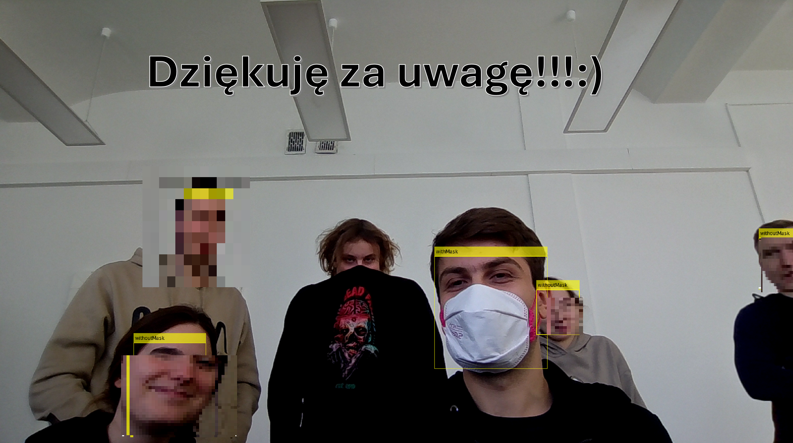
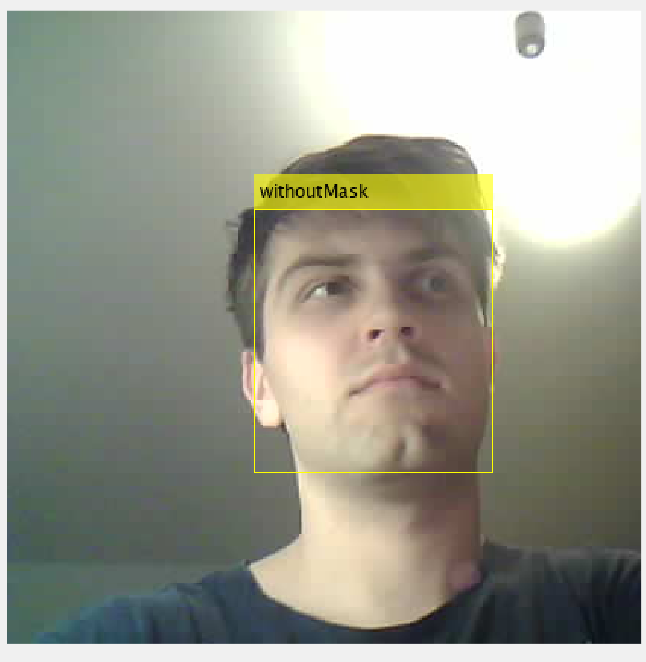
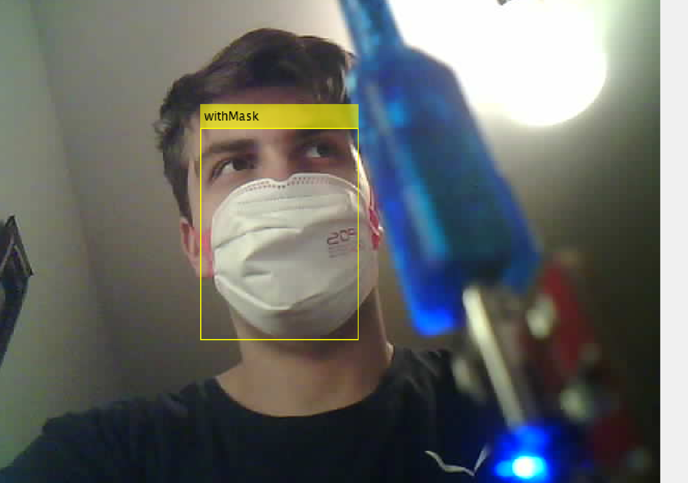

# Face Mask Detection (MATLAB + ESP32-CAM)

## 📌 Project Overview
This project detects whether a face mask is worn correctly using a YOLOv4 deep learning model implemented in MATLAB.  
The input image is captured in real time from an ESP32-CAM via an RTSP stream.

##  Classes
The model classifies images into three categories:
- `withMask` – mask worn correctly  
- `withoutMask` – no mask  
- `incorrectMask` – mask worn incorrectly  

##  How It Works
1. ESP32-CAM streams video via RTSP.  
2. MATLAB connects to the stream and captures frames.  
3. A selected frame is processed using YOLOv4.  
4. The system performs detection and classification of mask usage.  

